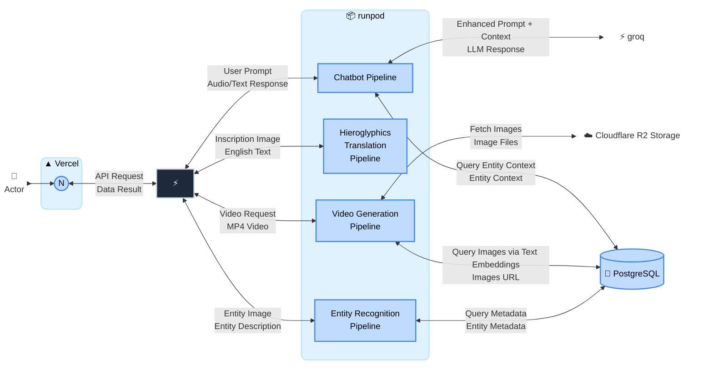

# E.C.H.O. System Architecture

To closely match the visual density of your reference image, this diagram collapses the dozens of internal micro-steps into **four core processing entities**. The technical details are now shifted onto the **connection arrows**, explaining exactly what data is being passed between the backend, the AI microservices, and the databases.

## Architecture Diagram

