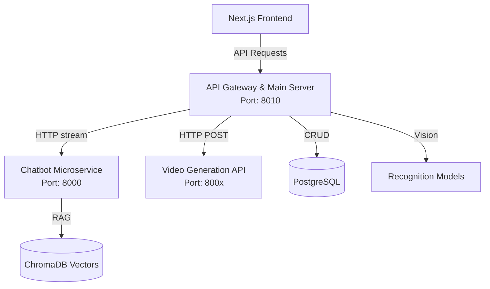

# Echo – AI-Powered Ancient Egypt Explorer

Echo is a multimodal AI system designed to explore Ancient Egypt through computer vision, natural language processing, and generative AI.

The system allows users to upload images of Egyptian landmarks, statues, or hieroglyphs and receive intelligent recognition, historical explanations, interactive conversations, and generated visual storytelling.

This project was developed as a Graduation Project in Artificial Intelligence.

## Project Overview

Ancient Egyptian history is rich but often difficult to explore interactively. Echo bridges this gap by combining:

* Image recognition
* Large Language Models
* Embedding-based retrieval
* Video generation
* Hieroglyph translation

The system transforms static historical content into an intelligent interactive experience.

## System Architecture

Echo uses a modern **Microservices Architecture** to separate lightweight routing/CRUD operations from heavy AI model inferences.



### Main Components:
* **API Gateway (`src/app`)**: Built with FastAPI. Handles frontend authentication, database CRUD operations, and forwards AI-heavy requests to the dedicated microservices.
* **Chatbot API (`src/chatbot_api`)**: Dedicated microservice for RAG, Groq LLM streaming, and Text-To-Speech generation.
* **Video Generation API (`src/video_generation_api`)**: Dedicated pipeline for automated historical video compilation.
* **Databases**: PostgreSQL (Relational) + ChromaDB (Vector).

## Project Structure

```text
ECHO/
|-- frontend/                  # Next.js Application
|-- src/                       # Microservices Workspace
|   |-- app/                   # 🚀 API Gateway & Orchestrator
|   |-- chatbot_api/           # 🤖 Chatbot & Voice Microservice
|   |-- video_generation_api/  # 🎥 Video Compiler Microservice
|   |-- db/                    # PostgreSQL Models & Sessions
|-- infra/                     # Code for Dockerizing services
|-- alembic/                   # Database Migrations
|-- README.md
```

## Installation & Running

### 1. Clone the repository
```bash
git clone https://github.com/karimtawfikk/ECHO.git
cd ECHO
```

### 2. Setup Python Environment
```bash
python -m venv venv
# Windows:
venv\Scripts\activate
# Mac/Linux:
source venv/bin/activate

pip install -r requirements.txt
pip install -r requirements.chatbot.txt
```

### 3. Configure Environment
Ensure you have `.env` properly configured in the root directory with your PostgreSQL connection string and API keys.

### 4. Running the Microservices

Because Echo uses a microservices architecture, you must run the Gateway and any AI services you intend to interact with.

**Run the API Gateway (Main Server)**
```bash
uvicorn src.app.main:app --reload --host 127.0.0.1 --port 8010
```

**Run the Chatbot Microservice**
*In a new terminal:*
```bash
uvicorn src.chatbot_api.app:app --host 127.0.0.1 --port 8000
```
*(Alternatively, you can run the chatbot via Docker using `docker-compose up`)*

**Run the Frontend**
*In a third terminal:*
```bash
cd frontend
npm run dev
```

---

## Core Modules

### 1. Landmark & Statue Recognition
Users upload an image of a historical landmark or statue. The system exacts visual embeddings and retrieves structured metadata from PostgreSQL.

### 2. Historical Video Generation
After recognition, the system generates a structured historical narration and scene descriptions derived strictly from verified data, converting historical text into short educational videos.

### 3. Conversational Historical Chatbot
Users can interact with the recognized entity through a conversational interface using RAG. The system grounds responses in stored metadata and maintains historical accuracy.

### 4. Hieroglyph Translation
Users upload an image containing hieroglyphs. The system detects symbols and generates structured translations.

## Database Design

The system contains structured entities such as Landmarks, Pharaohs, Builders, Dynasties, and Historical Events. Relationships are modeled using SQLAlchemy ORM and version-controlled using Alembic migrations.

## AI Techniques Used
* Multimodal Embeddings
* Similarity Search (ChromaDB)
* Retrieval-Augmented Generation (RAG)
* Diffusion Models
* Grounded Response Control

## Academic Context
This project was developed as part of an Artificial Intelligence graduation project to design a scalable AI system combining computer vision, NLP, and database systems.
