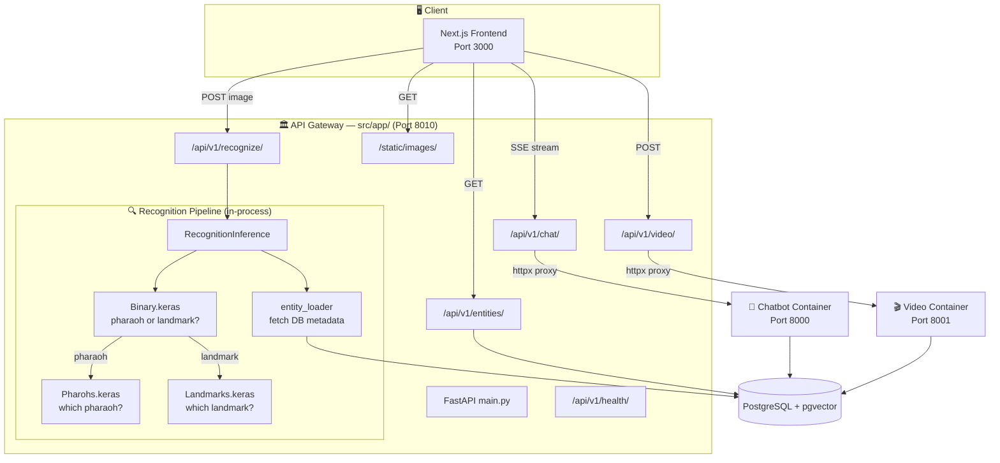

# E.C.H.O. Microservices Workspace (`src/`)

This directory acts as a monorepo workspace for all backend services that power E.C.H.O's AI features. Rather than a single monolithic backend, the backend is split into an orchestrating Gateway and multiple independent AI microservices.

## Architecture Layout



### 1. `app/` (The API Gateway)
This is the **Main Server**. It acts as the primary API exposing endpoints to the Next.js frontend. 
- Performs database CRUD operations.
- Validates user input.
- Proxies/streams requests to the heavy AI microservices.
- Run this on **Port 8010**: `uvicorn src.app.main:app --port 8010`

### 2. `chatbot_api/` (Standalone Microservice)
This is a dedicated, decoupled microservice that purely handles AI context integration.
- Hosts Retrieval-Augmented Generation (RAG) using ChromaDB and Groq embeddings.
- Synthesizes speech (TTS).
- Is generally run in a separate Docker container but can run natively.
- Run this on **Port 8000**: `uvicorn src.chatbot_api.app:app --port 8000`

### 3. `video_generation_api/` (Standalone Microservice)
This is an independent API pipeline designed for automated historical video compilation.

### Shared Resources
- **`db/`**: Shared SQLAlchemy database models, schemas, and configurations.
- **`models_weights/`**: Stores local AI weights (`.keras` and `.pkl` files) utilized by different pipelines.

## Shared Development Setup

1. **Virtual Environment**: You generally share one virtual environment for all microservices during local development.
   ```bash
   python -m venv venv
   source venv/bin/activate  # (Mac/Linux) or venv\Scripts\activate (Windows)
   ```

2. **Dependencies**: 
   Install general requirements and service-specific requirements found in the root directory:
   ```bash
   pip install -r requirements.txt
   pip install -r requirements.chatbot.txt
   ```

3. **Running the Full Stack**:
   Verify the instructions in the **Root `README.md`** to see how to start both the Gateway and the corresponding microservices simultaneously.
